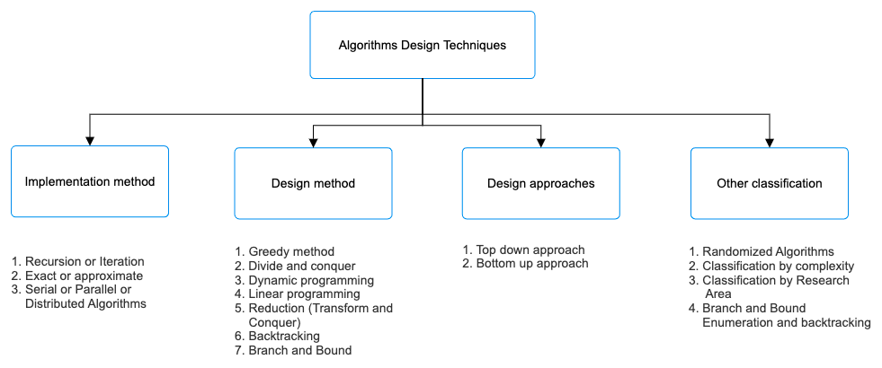

# Google-prep-material

**Algorithms**
1. Algorithmic Design Techniques
source: https://www.geeksforgeeks.org/algorithms-design-techniques/

    * Implementation Method
    * Design Method
    * Design Approaches
    * Other Classifications

2. Types of Algorithms

    * Sorting Algorithms
    * Searching Algorithms
    * Greedy Algorithms
    * Dynamic Programming
    * Pattern Searching
    * Backtracking Algorithms
    * Divide and Conquer
    * Mathematical Algorithms
    * Geometric Algorithms
    * Bitwise Algorithms
    * Graph Datastructures and Algorithms
    * Randomized Algorithms
    * Branch and Bound Algorithms
   
    1) Sorting Algorithms
       * Selection Sort
       * Bubble Sort
       * Insertion Sort
       * Merge Sort
       * Quick Sort
       * Heap Sort
       * Counting Sort
       * Radix Sort
       * Bucket Sort
       * Bingo Sort Algorithm
       * ShellSort
       * TimSort
       * Comb Sort
       * Pigeonhole Sort
       * Cycle Sort
       * Cocktail Sort
       * Strand Sort
       * Bitonic Sort
       * Pancake sorting
       * BogoSort or Permutation Sort
       * Gnome Sort
       * Sleep Sort – The King of Laziness
       * Structure Sorting in C++
       * Stooge Sort
       * Tag Sort (To get both sorted and original)
       * Tree Sort
       * Odd-Even Sort / Brick Sort
       * 3-way Merge Sort
    2) Searching Algorithms
       * Linear Search
       * Sentinel Linear Search
       * Binary Search
       * Meta Binary Search | One-Sided Binary Search
       * Ternary Search
       * Jump Search
       * Interpolation Search
       * Exponential Search
       * Fibonacci Search
       * The Ubiquitous Binary Search
    3) Greedy Algorithms
       1) Standard Greedy Algorithms:
          1) Kruskal's Minimum Spanning Tree (MST)
          2) Prim's MST
          3) Dijkstra's Shortest Path
          4) Huffman Coding
          5) Other greedy algorithms with Examples:
             1. Activity Selection Problem
             2. Job Sequencing Problem
             3. Huffman Coding
             4. Huffman Decoding
             5. Water Connection Problem
             6. Minimum Swaps for Bracket Balancing
             7. Egyptian Fraction
             8. Policemen catch thieves
             9. Fitting Shelves Problem
             10. Assign Mice to Holes
       2) Greedy Problems on Array:
          1. Minimum product subset of an array
          2. Maximize array sum after K negations using Sorting
          3. Minimum sum of product of two arrays
          4. Minimum sum of absolute difference of pairs of two arrays
          5. Minimum increment/decrement to make array non-Increasing
          6. Sorting array with reverse around middle
          7. Sum of Areas of Rectangles possible for an array
          8. Largest lexicographic array with at-most K consecutive swaps
          9. Partition into two subarrays of lengths k and (N – k) such that the difference of sums is maximum
       3) Greedy Problems on Operating System:
          1. First Fit algorithm in Memory Management
          2. Best Fit algorithm in Memory Management
          3. Worst Fit algorithm in Memory Management
          4. Shortest Job First Scheduling
          5. Job Scheduling with two jobs allowed at a time
          6. Program for Optimal Page Replacement Algorithm
       4) Greedy Problems on Graph:
          1. Kruskal’s Minimum Spanning Tree
          2. Prim’s Minimum Spanning Tree
          3. Boruvka’s Minimum Spanning Tree
          4. Dijkastra’s Shortest Path Algorithm
          5. Dial’s Algorithm
          6. Minimum cost to connect all cities
          7. Max Flow Problem Introduction
          8. Number of single cycle components in an undirected graph
       5) Approximate Greedy Algorithm for NP Complete:
          1. Set cover problem
          2. Bin Packing Problem
          3. Graph Coloring
          4. K-centers problem
          5. Shortest superstring problem
          6. Approximate solution for Travelling Salesman Problem using MST
       6) Greedy for Special cases of DP:
          1. Fractional Knapsack Problem
          2. Minimum number of coins required
    4) Dynamic Programming
       1) Advanced Concepts:
          1. Bitmasking and Dynamic Programming | Set 1
          2. Bitmasking and Dynamic Programming | Set-2 (TSP)
          3. Digit DP | Introduction
          4. Sum over Subsets | Dynamic Programming
       2) Standard problems on Dynamic Programming:
          * Easy:
              1. Fibonacci numbers
              2. nth Catalan Number
              3. Bell Numbers (Number of ways to Partition a Set)
              4. Binomial Coefficient
              5. Coin change problem
              6. Subset Sum Problem
              7. Compute nCr % p
              8. Cutting a Rod
              9. Painting Fence Algorithm
              10. Longest Common Subsequence
              11. Longest Increasing Subsequence
              12. Longest subsequence such that difference between adjacents is one
              13. Maximum size square sub-matrix with all 1s
              14. Min Cost Path
              15. Minimum number of jumps to reach end
              16. Longest Common Substring (Space optimized DP solution)
              17. Count ways to reach the nth stair using step 1, 2 or 3
              18. Count all possible paths from top left to bottom right of a mXn matrix
              19. Unique paths in a Grid with Obstacles
          * Medium:
              1. Floyd Warshall Algorithm
              2. Bellman–Ford Algorithm
              3. 0-1 Knapsack Problem
              4. Printing Items in 0/1 Knapsack
              5. Unbounded Knapsack (Repetition of items allowed)
              6. Egg Dropping Puzzle
              7. Word Break Problem
              8. Vertex Cover Problem
              9. Tile Stacking Problem
              10. Box-Stacking Problem
              11. Partition Problem
              12. Travelling Salesman Problem | Set 1 (Naive and Dynamic Programming)
              13. Longest Palindromic Subsequence
              14. Longest Common Increasing Subsequence (LCS + LIS)
              15. Find all distinct subset (or subsequence) sums of an array
              16. Weighted job scheduling
              17. Count Derangements (Permutation such that no element appears in its original position)
              18. Minimum insertions to form a palindrome
              19. Wildcard Pattern Matching
              20. Ways to arrange Balls such that adjacent balls are of different types
          * Hard:
              1. Palindrome Partitioning
              2. Word Wrap Problem
              3. The painter’s partition problem
              4. Program for Bridge and Torch problem
              5. Matrix Chain Multiplication
              6. Printing brackets in Matrix Chain Multiplication Problem
              7. Maximum sum rectangle in a 2D matrix
              8. Maximum profit by buying and selling a share at most k times
              9. Minimum cost to sort strings using reversal operations of different costs
              10. Count of AP (Arithmetic Progression) Subsequences in an array
              11. Introduction to Dynamic Programming on Trees
              12. Maximum height of Tree when any Node can be considered as Root
              13. Longest repeating and non-overlapping substring
    5) Pattern searching
       1) Some Standard Algorithms:
           - [ ] Rabin-Karp Algorithm
           - [ ] KMP Algorithm
           - [ ] Z algorithm (Linear time pattern searching Algorithm)
           - [ ] Finite Automata
           - [ ] Boyer Moore Algorithm – Bad Character Heuristic
           - [ ] Aho-Corasick Algorithm for Pattern Searching
           - [ ] Suffix Array
           - [ ] kasai’s Algorithm for Construction of LCP array from Suffix Array
           - [ ] Online algorithm for checking palindrome in a stream
           - [ ] Manacher’s Algorithm – Linear Time Longest Palindromic Substring – Part 4
           - [ ] Ukkonen’s Suffix Tree Construction – Part 1
           - [ ] Generalized Suffix Tree
    6) Backtracking algorithm
       1) Decision Problem
       2) Optimization Problem
       3) Enumeration Problem
    7) Divide and Conquer
       1) Quick sort
       2) Merge sort
       3) Closest pair of points
       4) Strassen's Algorithm
       5) Cooley-Tukey Fast Fourier Transform (FFT) algorithm
       6) Karatsuba algorithm for fast multiplication
       7) Binary search
       8) Convex Hull
       9) Quick Hull for Convex Hull
    8) Mathematical algorithms
       * Divisibility & Large Numbers
       * GCD and LCM
       * Series
       * Number Digits
       * Algebra
       * Number System
       * Prime numbers & Primality Tests
       * Prime Factorization & Divisors
       * Modular Arithmetic
       * Factorial
       * Fibonacci Numbers
       * Catalan Numbers
       * nCr Computations
       * Set Theory
       * Sieve Algorithms
       * Euler Totient Function
       * Chinese Remainder Theorem
    9) Geometric algorithms
        * Pattern Printing
        * Lines
        * Triangle
        * Rectangle | Square | Circle
        * Quadilateral
        * 3D Objects
        * Polygon & Convex Hull
    10) Bitwise algorithms
        * Standard bitwise problems
            * Easy:
              1. Binary representation of a given number
              2. Count set bits in an integer
              3. Add two bit strings
              4. Turn off the rightmost set bit
              5. Rotate bits of a number
              6. Compute modulus division by a power-of-2-number
              7. Find the Number Occurring Odd Number of Times
              8. Program to find whether a no is power of two
              9. Find position of the only set bit
              10. Check for Integer Overflow
              11. Find XOR of two number without using XOR operator
              12. Check if two numbers are equal without using arithmetic and comparison operators
              13. Detect if two integers have opposite signs
              14. How to swap two numbers without using a temporary variable?
              15. Russian Peasant (Multiply two numbers using bitwise operators)
            * Medium:
              1. Swap bits in a given number
              2. Smallest of three integers without comparison operators
              3. Compute the minimum or maximum of two integers without branching
              4. Smallest power of 2 greater than or equal to n
              5. Program to find parity
              6. Check if binary representation of a number is palindrome
              7. Generate n-bit Gray Codes
              8. Check if a given number is sparse or not
              9. Euclid’s Algorithm when % and / operations are costly
              10. Calculate square of a number without using *, / and pow()
              11. Cyclic Redundancy Check and Modulo-2 Division
              12. Copy set bits in a range
              13. Check if a number is Bleak
              14. Gray to Binary and Binary to Gray conversion
            * Hard:
              1. Next higher number with same number of set bits
              2. Karatsuba algorithm for fast multiplication
              3. Find the maximum subarray XOR in a given array
              4. Find longest sequence of 1’s in binary representation with one flip
              5. Closest (or Next) smaller and greater numbers with same number of set bits
              6. Bitmasking and Dynamic Programming | Set-2 (TSP)
              7. Compute the parity of a number using XOR and table look-up
              8. XOR Encryption by Shifting Plaintext
              9. Count pairs in an array which have at least one digit common
              10. Python program to convert floating to binary
              11. Booth’s Multiplication Algorithm
              12. Number of pairs with Pandigital Concatenation
              13. Find the n-th number whose binary representation is a palindrome
              14. Find the two non-repeating elements in an array of repeating elements
    11) Graphs
        1. Types of Graphs
           * Undirected Graphs
           * Directed Graphs
           * Weighted Graphs
           * Unweighted Graphs
           * Complete Graphs
           * Bipartite Graphs
           * Trees
           * Cycles
           * Sparse Graphs
           * Dense Graphs
        2. BFS and DFS in Graph
    12) Randomised Algorithms
        1. Classification 
           1. Las Vegas
           2. Monte - Carlo
        2. Problems on Randomized Algorithms:
           * Easy:
               1. Write a function that generates one of 3 numbers according to given probabilities
               2. Generate 0 and 1 with 25% and 75% probability
               3. Implement rand3() using rand2()
               4. Birthday Paradox
               5. Expectation or expected value of an array
               6. Shuffle a deck of cards
               7. Program to generate CAPTCHA and verify user
               8. Find an index of maximum occurring element with equal probability
               9. Randomized Binary Search Algorithm
           * Medium:
               1. Make a fair coin from a biased coin
               2. Shuffle a given array using Fisher–Yates shuffle Algorithm
               3. Expected Number of Trials until Success
               4. Strong Password Suggester Program
               5. QuickSort using Random Pivoting
               6. Operations on Sparse Matrices
               7. Estimating the value of Pi using Monte Carlo
               8. Implement rand12() using rand6() in one line
           * Hard:
               1. Generate integer from 1 to 7 with equal probability
               2. Implement random-0-6-Generator using the given random-0-1-Generator
               3. Select a random number from stream, with O(1) space
               4. Random number generator in arbitrary probability distribution fashion
               5. Reservoir Sampling
               6. Linearity of Expectation
               7. Introduction and implementation of Karger’s algorithm for Minimum Cut
               8. Select a Random Node from a Singly Linked List
               9. Select a Random Node from a tree with equal probability
               10. Freivald’s Algorithm to check if a matrix is product of two
               11. Random Acyclic Maze Generator with given Entry and Exit point

----------------------------------------------------------------
**Data Structures:**

